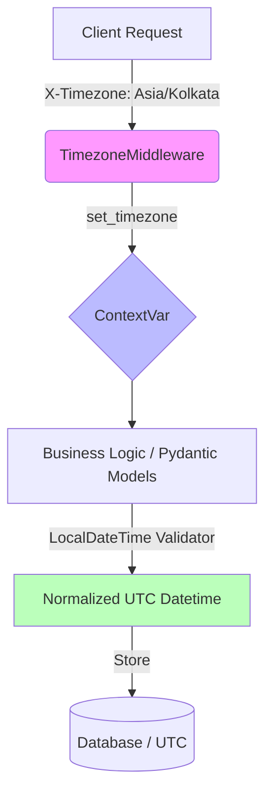

# tz-kit

Django-manered timezone handling for Python microservices (FastAPI/Starlette). A modern, `zoneinfo`-based toolkit.

## Core Philosophy
1. **UTC is the language of systems.** Everything stored in the database or passed between services is in UTC.
2. **Local time is the language of users.** The system accepts and provides time in the user's preferred timezone at the edge (middleware).

## How it Works
The package follows a "Set and Forget" architectural pattern:

1. **Extraction**: `TimezoneMiddleware` intercepts every incoming request and looks for the `X-Timezone` header (e.g., `Asia/Kolkata`).
2. **Contextualization**: It sets this timezone in an async-safe `ContextVar`. This ensures that even in highly concurrent environments, each request runs in its own timezone "bubble".
3. **Normalization**: When a Pydantic model uses the `LocalDateTime` type, it automatically detects:
    - **Naive datetimes**: Converted from the request's timezone to UTC.
    - **Time-only strings/objects** (e.g., "10:30"): Anchored to *today* in the request's timezone and converted to UTC.
    - **Flexible Formats**: Handles non-standard separators like `2026:01:10 10:56` or `2026/01/10`.
    - **ISO datetimes**: Normalized to UTC.

### Request Flow Overview



## Key Features
- **Modern Python**: Built on `zoneinfo` (PEP 615).
- **Pydantic Integration**: Seamlessly handles timezone conversion in request schemas.
- **Async Ready**: Uses `ContextVar` for thread-safe/async-safe context management.
- **Microservices Ready**: Optimized for the `X-Timezone` header standard.
- **Industry Grade**: Handles DST gaps/overlaps and extreme dates correctly.

## Installation
```bash
pip install -r requirements.txt
```

### From GitHub (For other microservices)
To use this package in other services without publishing to PyPI, install directly from git:

```bash
pip install git+https://github.com/StartUp-Software-Pvt-Ltd/common-timezone.git
```
*Note: Replace the URL with your actual repository URL.*

## Quick Start

### 1. Register Middleware
```python
from fastapi import FastAPI
from tz_kit import TimezoneMiddleware

app = FastAPI()
app.add_middleware(TimezoneMiddleware)
```

### 2. Use LocalDateTime in Models
```python
from pydantic import BaseModel
from tz_kit import LocalDateTime

class AppointmentSchema(BaseModel):
    start_time: LocalDateTime # Automatically converts naive inputs to UTC
```

### 3. Manual Conversion Helpers
```python
from tz_kit import utc_to_local, local_to_utc

# Manual conversion when needed
local_time = utc_to_local(utc_datetime)
```

## Validation Modes
- **Lenient (Default)**: If an invalid timezone is provided, the system falls back to UTC to ensure production availability.
- **Strict**: Use `set_timezone(tz, strict=True)` for internal tasks or validation to raise an `InvalidTimezoneError`.
